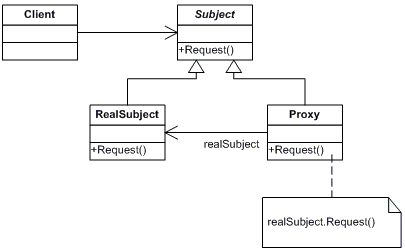
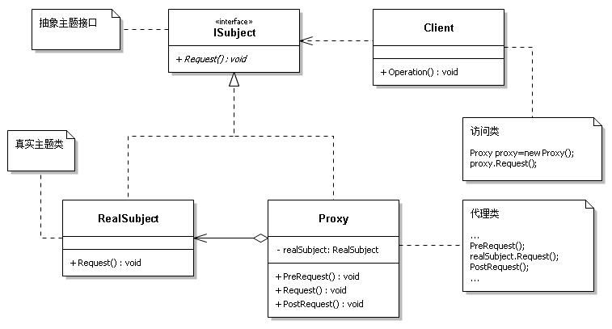

### 个人理解写在前面
开始了解这个模式时，总感觉毫无用处
为什么要创建一个代理对象，再把目标对象放进去，我再去调用代理对象内？为了在某些方法执行前后添加逻辑吗？
为什么代理类要和目标类继承同一个接口？
感觉很绕，很多余，没有用处！

经过多篇文章的参考，稍微有了一点理解，记录如下：
1. 是谁使用？
    框架或者某个对象的构建者使用，负责被代理对象的功能实现和生命周期
2. 什么时候使用？
    如第一篇文档所说，是在模式完成后。我的理解就是在功能实现后需要增加或修改逻辑时使用，而又不影响既有功能，也就是被代理对象的下游使用者
    所以代理对象和被代理对象继承了相同的接口
3. 如何代理
    


### [来源文章1](https://www.cnblogs.com/zhili/p/DesignPatternSummery.html)

在系统开发中，有些对象由于网络或其他的障碍，以至于不能直接对其访问，此时可以通过一个代理对象来实现对目标对象的访问。如.NET中的调用Web服务等操作。

　　代理模式指的是给某一个对象提供一个代理，并由代理对象控制对原对象的访问。具体的结构图如下所示。


注：外观模式、适配器模式和代理模式区别？

　　解答：这三个模式的相同之处是，它们都是作为客户端与真实被使用的类或系统之间的一个中间层，起到让客户端间接调用真实类的作用，不同之处在于，所应用的场合和意图不同。

　　代理模式与外观模式主要区别在于，代理对象无法直接访问对象，只能由代理对象提供访问，而外观对象提供对各个子系统简化访问调用接口，而适配器模式则不需要虚构一个代理者，目的是复用原有的接口。外观模式是定义新的接口，而适配器则是复用一个原有的接口。

　　另外，它们应用设计的不同阶段，外观模式用于设计的前期，因为系统需要前期就需要依赖于外观，而适配器应用于设计完成之后，当发现设计完成的类无法协同工作时，可以采用适配器模式。然而很多情况下在设计初期就要考虑适配器模式的使用，如涉及到大量第三方应用接口的情况；代理模式是模式完成后，想以服务的方式提供给其他客户端进行调用，此时其他客户端可以使用代理模式来对模块进行访问。

　　总之，代理模式提供与真实类一致的接口，旨在用来代理类来访问真实的类，外观模式旨在简化接口，适配器模式旨在转换接口。

### [来源文章2](https://zhuanlan.zhihu.com/p/634784550)

代理模式是一种结构型设计模式，它提供了一个对象代替另一个对象来控制对它的访问。代理对象可以在客户端和目标对象之间起到中介的作用，并添加其他的功能。

以下是在C#中实现代理模式的一个简单示例：
```
// 抽象主题接口
public interface ISubject
{
    void Request();
}

// 真实主题
public class RealSubject : ISubject
{
    public void Request()
    {
        Console.WriteLine("RealSubject: Handling Request.");
    }
}

// 代理
public class Proxy : ISubject
{
    private RealSubject _realSubject;

    public Proxy(RealSubject realSubject)
    {
        this._realSubject = realSubject;
    }

    public void Request()
    {
        if (this.CheckAccess())
        {
            this._realSubject.Request();
            this.LogAccess();
        }
    }

    public bool CheckAccess()
    {
        // 检查是否有权限访问
        Console.WriteLine("Proxy: Checking access prior to firing a real request.");
        return true;
    }

    public void LogAccess()
    {
        // 记录请求
        Console.WriteLine("Proxy: Logging the time of request.");
    }
}
```
在这个代码中，ISubject是一个接口，定义了Request方法。RealSubject是实现了ISubject接口的类，Proxy是代理类，它也实现了ISubject接口，并持有一个RealSubject对象的引用。

以下是一个使用这个模式的示例：
```
class Program
{
    static void Main(string[] args)
    {
        Console.WriteLine("Client: Executing the client code with a real subject:");
        RealSubject realSubject = new RealSubject();
        realSubject.Request();

        Console.WriteLine();

        Console.WriteLine("Client: Executing the same client code with a proxy:");
        Proxy proxy = new Proxy(realSubject);
        proxy.Request();

        Console.ReadLine();
    }
}
```
在这个例子中，我们首先直接调用了RealSubject的Request方法，然后我们通过代理调用了相同的方法。注意，在通过代理调用Request方法时，代理还执行了其他的操作，如检查访问权限和记录日志。

执行流程如下：

创建一个真实主题对象，并直接调用其Request方法。
创建一个代理对象，代理对象包含一个真实主题的引用。
通过代理对象调用Request方法。在这个方法中，代理首先检查访问权限，然后调用真实主题的Request方法，最后记录日志。

### [来源文章3](https://www.cnblogs.com/timefiles/p/ProxyPattern.html)

在有些情况下，一个客户不能或者不想直接访问另一个对象，这时需要找一个中介帮忙完成某项任务，这个中介就是代理对象。

定义与特点#
由于某些原因需要给某对象提供一个代理以控制对该对象的访问。这时，访问对象不适合或者不能直接引用目标对象，代理对象作为访问对象和目标对象之间的中介。

主要优点有：

代理模式在客户端与目标对象之间起到一个中介作用和保护目标对象的作用。
代理对象可以扩展目标对象的功能。
代理模式能将客户端与目标对象分离，在一定程度上降低了系统的耦合度。
主要缺点有：

在客户端和目标对象之间增加一个代理对象，会造成请求处理速度变慢。
增加了系统的复杂度。
结构与实现#
代理模式的结构比较简单，主要是通过定义一个继承抽象主题的代理来包含真实主题，从而实现对真实主题的访问。

模式的结构#
代理模式的主要角色如下：

抽象主题（Subject）类：通过接口或抽象类（推荐使用接口）声明真实主题和代理对象实现的业务方法。
真实主题（Real Subject）类：实现了抽象主题中的具体业务，是代理对象所代表的真实对象，是最终要引用的对象。
代理（Proxy）类：提供了与真实主题相同的接口，其内部含有对真实主题的引用，它可以访问、控制或扩展真实主题的功能。
其结构图如图所示：



模式的实现#
代理模式的实现代码如下：
```
//访问类
class Program
{
    static void Main(string[] args)
    {
        //代理模式        
        Proxy proxy=new Proxy();
        proxy.Request();       
        Console.ReadKey();
    }
}

//抽象主题
public interface ISubject
{
    void Request();
}

//真实主题
public class RealSubject :ISubject
{
    public void Request()
    {
        Console.WriteLine("访问真实主题方法...");
    }
}

//代理
public class Proxy : ISubject
{
    private RealSubject realSubject;
    public void Request()
    {
        if (realSubject==null)
        {
            realSubject=new RealSubject();
        }
        PreRequest();
        realSubject.Request();
        PostRequest();
    }
    public void PreRequest()
    {
        Console.WriteLine("访问真实主题之前的预处理。");
    }
    public void PostRequest()
    {
        Console.WriteLine("访问真实主题之后的后续处理。");
    }
}
```
程序运行的结果如下：
```
访问真实主题之前的预处理。
访问真实主题方法...
访问真实主题之后的后续处理。
应用场景#
前面分析了代理模式的结构与特点，现在来分析以下的应用场景:
```
远程代理（Remote Proxy）：这种方式通常是为了隐藏目标对象存在于不同地址空间的事实，方便客户端访问。
例如，用户访问网盘的虚拟硬盘时实际访问的是网盘空间。
虚拟代理（Virtual Proxy）：这种方式通常用于要创建的目标对象开销很大时。
例如，下载一幅很大的图像需要很长时间，这时可以先用小比例的虚拟代理替换真实的对象，消除用户对服务器慢的感觉。
保护代理（Protection Proxy）：这种方式通常用于控制不同种类客户对真实对象的访问权限。
智能指引（Smart Reference）：主要用于调用目标对象时，代理附加一些额外的处理功能。
智能指引的典型用途包括：

增加计算真实对象的引用次数的功能，这样当该对象没有被引用时，就可以自动释放它；
当第一次引用一个持久对象时，将它装入内存。
在访问一个实际对象前，检查是否已经锁定了它，以确保其他对象不能改变它。
扩展：动态代理模式#
在前面介绍的代理模式中，代理类中包含了对真实主题的引用，这种方式存在两个缺点：

真实主题与代理主题一一对应，增加真实主题也要增加代理。
设计代理以前真实主题必须事先存在，不太灵活。
采用动态代理模式可以解决以上问题（如 SpringAOP），C#中可以使用RealProxy实现动态代理，有两种方法：
第一种：只使用RealProxy，不能代理带out参数的方法（可能是我没找到），代码如下：
```
class Program
{
    static void Main(string[] args)
    {
        Console.WriteLine("***\r\n Begin program - logging with decorator\r\n");
        IRepository<Customer> customerRepository =RepositoryFactory.Create<Customer>();
        var customer = new Customer()
        {
            Id = 1,
            Name = "Customer 1",
            Address = "Address 1"
        };
        customerRepository.Add(customer);
        customerRepository.Update(customer);
        customerRepository.Delete(customer);
        Console.WriteLine("\r\nEnd program - logging with decorator\r\n***");
        Console.ReadLine();
    }
}
//客户类
public class Customer
{
    public int Id { get; set; }
    public string Name { get; set; }
    public string Address { get; set; }
}

//存储库接口
public interface IRepository<T>
{
    void Add(T entity);
    void Delete(T entity);
    void Update(T entity);
    IEnumerable<T> GetAll();
    T GetById(int id);
}

//真实储存库
public class Repository<T> : IRepository<T>
{
    public void Add(T entity)
    {
        Console.WriteLine("Adding {0}", entity);
    }
    public void Delete(T entity)
    {
        Console.WriteLine("Deleting {0}", entity);
    }
    public void Update(T entity)
    {
        Console.WriteLine("Updating {0}", entity);
    }
    public IEnumerable<T> GetAll()
    {
        Console.WriteLine("Getting entities");
        return null;
    }
    public T GetById(int id)
    {
        Console.WriteLine("Getting entity {0}", id);
        return default(T);
    }
} 

//动态代理
class DynamicProxy<T> : RealProxy
{
    private readonly T _decorated;
    public DynamicProxy(T decorated) : base(typeof(T))
    {
        _decorated = decorated;
    }
    private void Log(string msg, object arg = null)
    {
        Console.ForegroundColor = ConsoleColor.Red;
        Console.WriteLine(msg, arg);
        Console.ResetColor();
    }
    public override IMessage Invoke(IMessage msg)
    {
        var methodCall = msg as IMethodCallMessage;
        var methodInfo = methodCall.MethodBase as MethodInfo;
        Log("In Dynamic Proxy - Before executing '{0}'",methodCall.MethodName);
        try
        {
            var result = methodInfo.Invoke(_decorated, methodCall.InArgs);
            Log("In Dynamic Proxy - After executing '{0}' ",methodCall.MethodName);
            return new ReturnMessage(result, null, 0,methodCall.LogicalCallContext, methodCall);
        }
        catch (Exception e)
        {
            Log(string.Format("In Dynamic Proxy- Exception {0} executing '{1}'", e),methodCall.MethodName);
            return new ReturnMessage(e, methodCall);
        }
    }
}

//存仓库过程，自动执行代理
public class RepositoryFactory
{
    public static IRepository<T> Create<T>()
    {
        var repository = new Repository<T>();
        var dynamicProxy = new DynamicProxy<IRepository<T>>(repository);
        return dynamicProxy.GetTransparentProxy() as IRepository<T>;
    }
}    
```
第二种：使用RealProxy、MarshalByRefObject，可以代理带out参数的方法，代码如下：
```
//访问类
public class Program
{
    static void Main(string[] args)
    {
        //动态代理模式        
        Proxy<ISubject> proxy = new Proxy<ISubject>(new RealSubject());
        ISubject subject = (ISubject)proxy.GetTransparentProxy();
        int arg = 0;
        subject.Request(out arg); 
        Console.WriteLine(arg);
        Console.ReadKey();
    }
}
//代理类
public class Proxy<T> : RealProxy where T: class
{    
    MarshalByRefObject myMarshalByRefObject;
    public Proxy(MarshalByRefObject realT) : base(typeof(T))
    {        
        myMarshalByRefObject = realT;
    }
    public override IMessage Invoke(IMessage myMessage)
    {        
        IMethodCallMessage myCallMessage = (IMethodCallMessage)myMessage;
        Console.WriteLine("动态代理方法中：执行前");
        IMethodReturnMessage myIMethodReturnMessage = RemotingServices.ExecuteMessage(myMarshalByRefObject, myCallMessage);
        Console.WriteLine("动态代理方法中：执行后");
        return myIMethodReturnMessage;
    }
}

//抽象主题
public interface ISubject
{
    void Request(out int arg);
}

//真实主题
public class RealSubject : MarshalByRefObject,ISubject
{
    public void Request(out int arg)
    {
        arg = 1;
        Console.WriteLine("访问真实主题方法...");       
    }
}
```

参考资料#
[C#中动态代理与泛型函数——CSDN](https://blog.csdn.net/tanzhangwen/article/details/48240023?utm_medium=distribute.pc_aggpage_search_result.none-task-blog-2~all~baidu_landing_v2~default-1-48240023.nonecase&utm_term=c#%E4%BB%A3%E7%90%86%E6%A8%A1%E5%BC%8F%20%E5%8A%A8%E6%80%81%E4%BB%A3%E7%90%86)
[面向方面的编程-使用 RealProxy 类进行面向方面的编程——MSDN](https://docs.microsoft.com/zh-cn/archive/msdn-magazine/2014/february/aspect-oriented-programming-aspect-oriented-programming-with-the-realproxy-class)