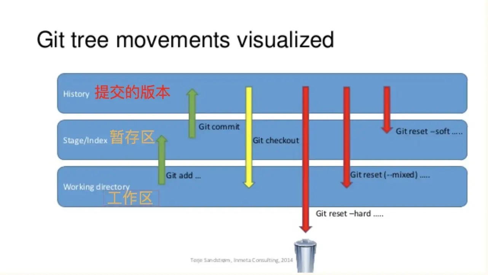

# Git Reset 命令
用于撤销提交、回溯版本和调整工作目录或暂存区状态的强大命令  


有三种不同的模式：--soft，--mixed，--hard，如下：

* ### mixed 
默认模式，移动 HEAD 指针并重置索引，不会修改工作区，撤销了提交和暂存的更改，但保留了工作区的修改。例如：

```
git reset --mixed HEAD^ //回退上一个版本  
git reset HEAD^ //回退上一个版本  
git reset 1a2b3c //回退到指定版本
```

* ### soft 
保留工作目录的内容，并把因为重置 HEAD 所带来的新的文件差异放进暂存区。例如：

```
git reset --soft HEAD^^ # 回退上上一个版本  
```

* ### hard 
移动 HEAD 指针并重置索引和工作区，彻底删除了提交以及暂存区和工作区的修改，慎用，因为会导致工作区的内容丢失。例如：

```
git reset --hard HEAD^^^  # 回退上上上一个版本  
```

## HEAD说明：
使用 ^ 表示
- HEAD 表示当前版本
- HEAD^ 上一个版本
- HEAD^^ 上上一个版本
- HEAD^^^ 上上上一个版本
......以此类推

使用 ~数字表示
- HEAD~0 表示当前版本
- HEAD~1 上一个版本
- HEAD^2 上上一个版本
- HEAD^3 上上上一个版本
......以此类推

